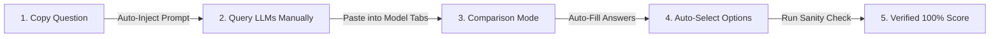

# NPTEL CopyFill

<p align="center">
  
</p>

<p align="center">
  <strong>The Intelligent Multi-LLM Comparison, Auto-Fill & Sanity Check Copilot for NPTEL & Swayam.</strong>
</p>

<p align="center">
  <a href="#why-nptel-copyfill-isnt-just-another-copy-paster">Why It's Different</a> •
  <a href="#key-modes--features">Key Modes & Features</a> •
  <a href="#quick-start-installation">Quick Start</a> •
  <a href="#how-it-works">How It Works</a> •
  <a href="#privacy--domain-security">Privacy</a>
</p>

---

> **Note on Transparency**: NPTEL CopyFill is **NOT an autonomous solver or answer generator**. It does not infer or generate answers independently. You (the student) manually query your trusted AI tools or course resources, review the outputs, and paste them into CopyFill. The extension simply automates repetitive UI clicking, option matching, and consensus matrix comparison on your NPTEL assignment page.

---

## Why NPTEL CopyFill Isn't Just Another Copy-Paster

Generic extensions simply unlock right-click or blindly pick option A. **NPTEL CopyFill is a human-in-the-loop workflow copilot** that helps you compare multiple AI outputs side-by-side, auto-selects your verified answers directly on the page, and runs real-time sanity checks before submission.

### Core Highlights:

* **Multi-LLM Comparison Mode**: Paste responses from ChatGPT, Gemini, Claude, or DeepSeek into model tabs. Compare all outputs side-by-side in a live Matrix table with instant Match and Conflict badges.
* **Smart Auto-Fill Mode**: Automatically matches your pasted LLM answers to the actual NPTEL page elements and selects the corresponding radio buttons, multi-answer checkboxes, and text fields in a single click.
* **Sanity Check Mode**: Runs a diagnostic check over your active page selections against LLM consensus—calculating a live confidence score and color-coding valid, invalid, and missing answers directly on the page.
* **Automatic Copy & Prompt Attachment**: Silently removes copy-paste restrictions and automatically attaches structured output instructions to your clipboard whenever you copy an assignment question.

---

## Key Modes & Features

### 1. Multi-LLM Comparison Mode
Add as many AI models as you like (ChatGPT, Gemini, Claude, etc.). Set a **Primary Model** as your source of truth, and let NPTEL CopyFill compare all model outputs in a unified consensus matrix.

### 2. Auto-Fill Answers (Human-in-the-Loop)
Once you have gathered and verified your answers, click **Auto-Fill Answers**. Instead of manually selecting choices line-by-line, NPTEL CopyFill automatically parses your input text—matching text content, option identifiers, and multi-selection lists directly to the page's input elements.
Please provide the correct answers for each question below strictly in the following format:
1. Option letter or exact answer
2. Option letter or exact answer
...
Example:
1. A
2. C
3. B
Do not include extra explanations or conversational text.
### 3. Sanity Check Mode
Before submitting your assignment, click **Run Sanity Check**. The extension evaluates your selected options against model consensus, highlighting matching selections in green, conflicting selections in red, and unanswered questions in yellow.

### 4. Copy-Paste & Selection Unblocker
Removes NPTEL's right-click blocks, `Ctrl+C` / `Ctrl+V` locks, and text selection preventers so you can navigate and copy questions effortlessly.

---

## Quick Start (1-Minute Chrome Installation)

No build tools or complex setup required:

1. **Download / Clone Repo**:
   ```bash
   git clone https://github.com/geervan/nptel-copyfill.git
   ```
   *(Or download and extract the ZIP file)*

2. **Open Chrome Extensions**:
   * Navigate to `chrome://extensions/` in your browser.
   * Enable **Developer mode** using the toggle switch in the top-right corner.

3. **Load Extension**:
   * Click **Load unpacked** in the top-left.
   * Select the `nptel-copyfill` project folder.

4. **Ready to Use**:
   * Open any assignment on NPTEL or Swayam. Click **NPTEL CopyFill** to launch the drawer.

---

## How It Works



1. **Copy Question**: Highlight any question on NPTEL and copy (`Ctrl+C`).
2. **Query LLMs Manually**: Get answers from your favorite AI models using the formatted prompt.
3. **Compare Answers**: Paste into the NPTEL CopyFill drawer to see consensus.
4. **Auto-Fill & Verify**: Click **Auto-Fill Answers** and run **Sanity Check** to verify all choices visually on screen.

---

## Privacy & Security

* **100% Local Execution**: All string parsing and consensus matching happen strictly inside your browser.
* **No Telemetry**: NPTEL CopyFill does not send clipboard data or answers to any external server.
* **Domain Restricted**: Only runs on official NPTEL and Swayam domains (`*.nptel.ac.in`, `*.swayam.gov.in`).

---

## Creator & Credits

Crafted with care by **[Geervan](https://www.linkedin.com/in/geervan/)**.

If NPTEL CopyFill saved you time on your assignments, give this repository a star on GitHub!
